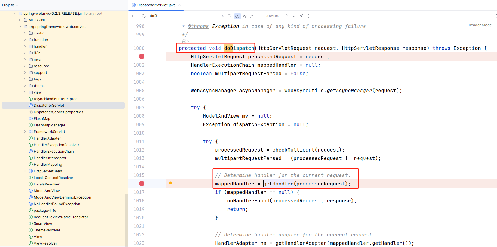

1.先看源码。首先需要明确目标是什么：目标是理解从HTTP请求到Controller方法执行的完整链路

```java
核心就是DispatcherServlet类的doDispatch方法
在这个方法里面，前面都是一些初始化操作，不用重点看，主要是
mappedHandler = getHandler(processedRequest);
这个代码就是获取处理器的，根据你的request的url路径，获取对应的处理器。具体方法也没啥神秘的，就是循环遍历mapping，找到了就返回，找不到就返回空
然后就是HandlerAdapter ha = getHandlerAdapter(mappedHandler.getHandler()); 获取处理器适配器
最后就是
// Actually invoke the handler.
mv = ha.handle(processedRequest, response, mappedHandler.getHandler());
这串代码就是反射执行controller的具体方法。
```

