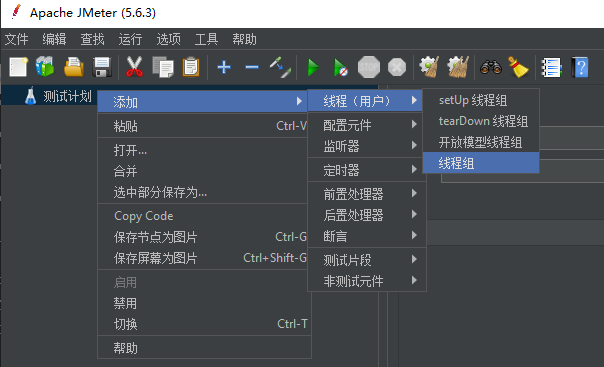
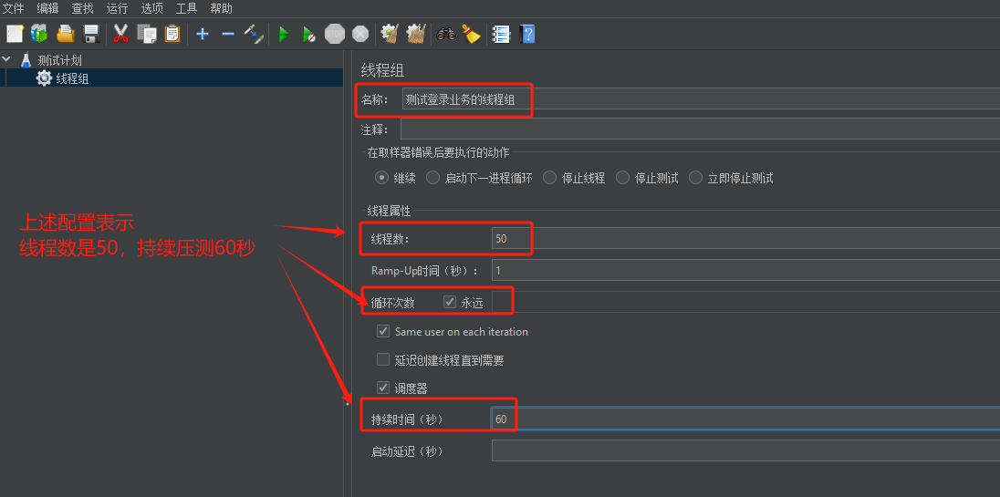
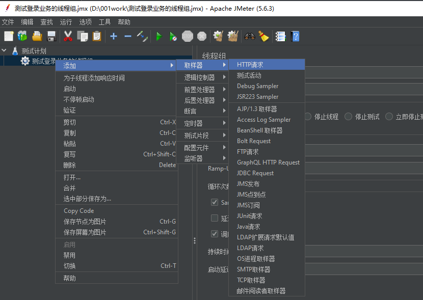
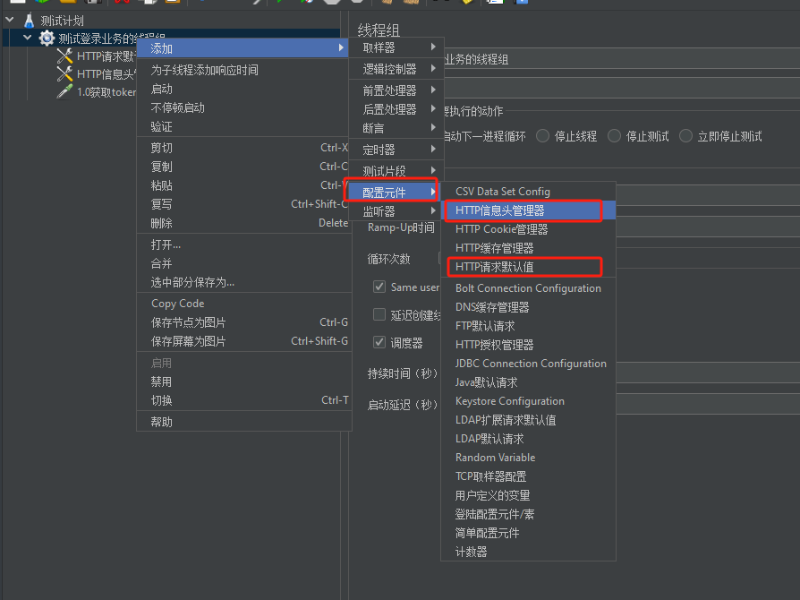
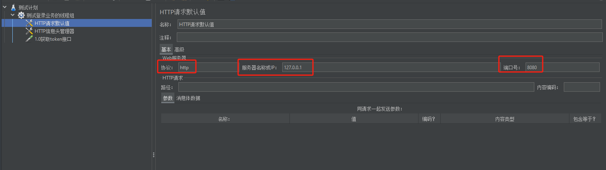
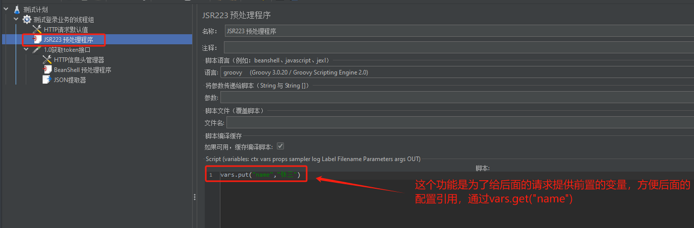
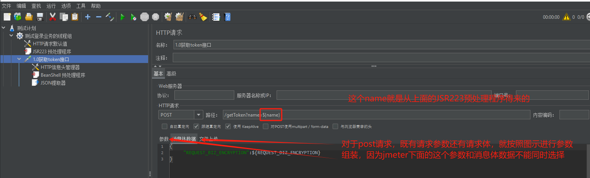
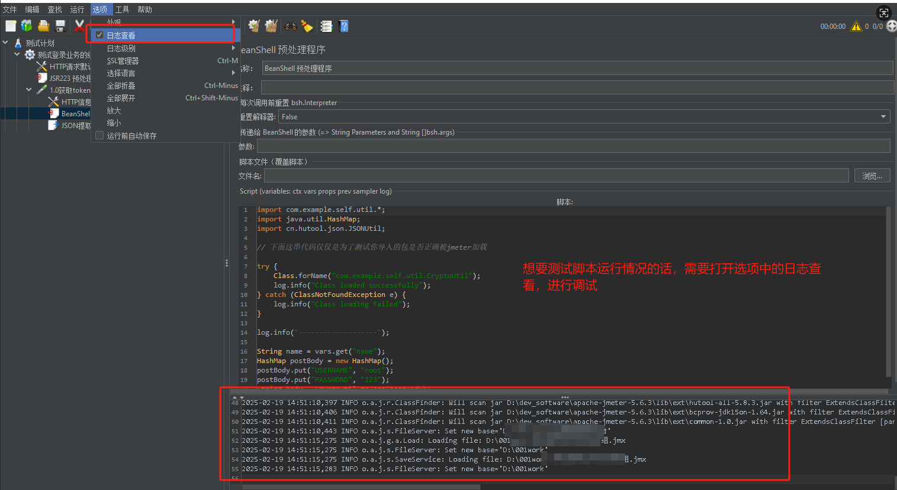
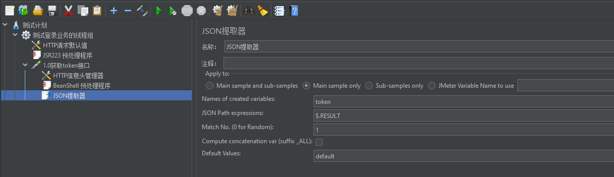
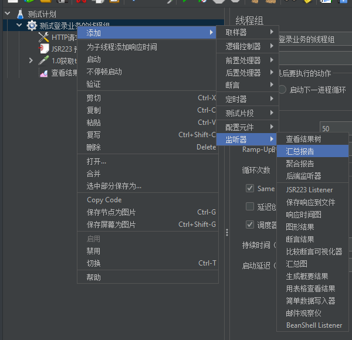

1.下载并安装Jmeter

2.进入bin目录，进行启动【win操作系统】，双击jmeter.bat

3.添加一个线程组，这个线程组里面就存放你将来要进行测试的接口

线程组可以配置以下参数

4.在当前线程组下创建准备压测的接口

通常的场景第一步你得获取token，那么就先压测获取token的接口

然后配置要压测的接口信息，通常情况下压测需要配置HTTP请求默认值。方便后续HTTP请求不用重复配置IP，如下图

上图中有个坑需要注意：当你自己写的工具包已经放入`apache-jmeter-5.6.3\lib\ext`目录下了，但是你发现调用你自己开发的方法还是报错，可能的原因是你自己开发的jar包引入了第三方包，你需要把引入的第三方包也放在`apache-jmeter-5.6.3\lib\ext`目录下！

然后就是json提取器，可以从该接口的返回结果中提取变量，供后续其他接口使用。

5.添加汇总报告、聚合报告、查看结果树

进行详细的压测结果查看。重点关注的数据就是汇总报告中的平均值、异常、吞吐量